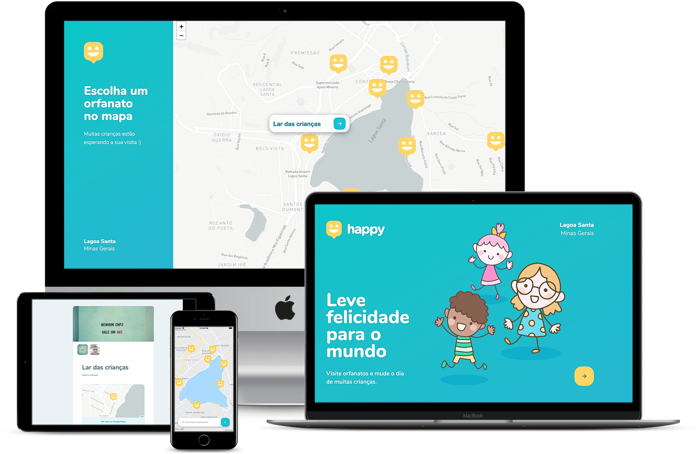

<h1 align="center">
    
    <br/><br/>
    Semana Next Level Week 3.0
    <br/><br/>
</h1>

<p align="center">
  <a href="#sobre">Projeto</a>&nbsp;&nbsp;&nbsp;|&nbsp;&nbsp;&nbsp;
  <a href="#tecnologias">Tecnologias</a>&nbsp;&nbsp;&nbsp;|&nbsp;&nbsp;&nbsp;
  <a href="#setup">Setup</a>&nbsp;&nbsp;&nbsp;|&nbsp;&nbsp;&nbsp;
  <a href="#layout">Layout</a>&nbsp;&nbsp;&nbsp;|&nbsp;&nbsp;&nbsp;
  <a href="#licença">Licença</a>
</p>
<p align="center">
 

  
</p>
<br>
## Projeto

O Happy é uma aplicação que conecta pessoas à casas de acolhimento institucional para fazer o dia de muitas crianças mais feliz.

## Tecnologias

Esse projeto foi desenvolvido com as seguintes tecnologias:

- [JavaScript](https://developer.mozilla.org/pt-BR/docs/Web/JavaScript)
- [Node.js](https://nodejs.org/en/)
- [React](https://reactjs.org)
- [React Native](https://facebook.github.io/react-native/)
- [Expo](https://expo.io/)
- [SQLite](https://www.sqlite.org/index.html)
- [TypeScript](https://www.typescriptlang.org)
  

## Setup

- Abra as pastas **backend, frontend, mobile** e execute `yarn` para instalar todas as dependencies

### backend

```bash
# Entre no repositório
$ cd backend

# Instale as dependências
$ yarn

# Execute as Migrates
$ yarn typeorm migration:run

# Inicie o server
$ yarn dev:server

# Será executado na port 3333
```
### Frontend

```bash
# Entre no repositório
$ cd frontent

# Instale as dependências
$ yarn

# Execute a aplicação
$ yarn start

# Será executado na port 3000
```

### Mobile

```bash
# Entre no repositório
$ cd mobile

# Instale as dependências
$ yarn

# Execute a aplicação
$ yarn start

```
## Layout

<div align="center">
    
</div>

<br/><br/>

Nos links abaixo você encontra o layout do projeto web e também do mobile. Lembrando que você precisa ter uma conta no [Figma](http://figma.com/) para acessá-lo.

- [Layout Web](https://www.figma.com/file/mDEbnoojksG4w8sOxmudh3/Happy-Web)
- [Layout Mobile](https://www.figma.com/file/X27FfVxAgy9f5IFa7ONlph/Happy-Mobile)

<br/>

---
